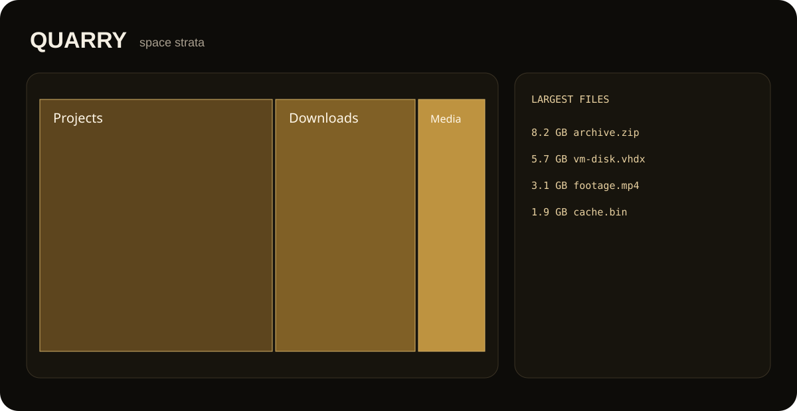

<div align="center">
  
  <h1>Quarry</h1>
  <p><strong>Expose what is consuming disk space and where it lives.</strong></p>
  <p><a href="#run-from-source"><strong>Run from source</strong></a> · <a href="https://github.com/purysho/Quarry/issues">Report an issue</a></p>
</div>

Quarry is a local-first disk-space explorer. It walks a folder or drive, aggregates usage by top-level path and extension, surfaces the largest files, and renders a dependency-free treemap-style view.



## Features
- Recursive disk-usage scan
- Top-level folder aggregation
- Extension and age buckets
- Largest-file list
- Visual space map
- JSON export
- Read-only: Quarry never deletes or modifies scanned files

## Run from source
```powershell
pyw quarry_desktop.pyw
```

## Tests
```powershell
python -m unittest discover -s tests -v
```

## Windows build
```powershell
powershell -ExecutionPolicy Bypass -File .\build-windows.ps1
```

## License
MIT
