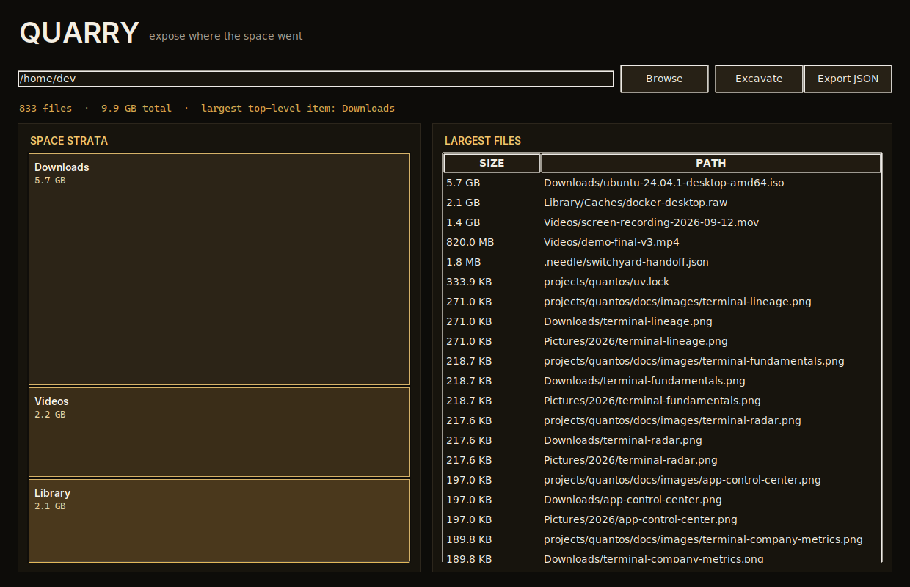

<div align="center">
  
  <h1>Quarry</h1>
  <p><strong>Expose what is consuming disk space and where it lives.</strong></p>
  <p>
    <a href="https://github.com/purysho/Quarry/actions/workflows/ci.yml"></a>
    <a href="https://github.com/purysho/Quarry/releases"></a>
    <a href="LICENSE"></a>
    <a href="#download"></a>
  </p>
  <p><strong>Download:</strong> <a href="https://github.com/purysho/Quarry/releases/latest/download/Quarry-Windows-x64.exe">Windows</a> · <a href="https://github.com/purysho/Quarry/releases/latest/download/Quarry-macOS-arm64.zip">macOS</a> · <a href="https://github.com/purysho/Quarry/releases/latest/download/Quarry-Linux-x86_64.tar.gz">Linux</a> · <a href="#run-from-source">Run from source</a> · <a href="https://github.com/purysho/Quarry/issues">Report an issue</a></p>
</div>

Quarry is a local-first disk-space explorer. It walks a folder or drive, aggregates usage by top-level path and extension, surfaces the largest files, and renders a dependency-free treemap-style view.



## Features
- Recursive disk-usage scan
- Top-level folder aggregation
- Extension and age buckets
- Largest-file list
- Visual space map
- JSON export
- Read-only: Quarry never deletes or modifies scanned files

## Download

| Platform | File |
|---|---|
| Windows 10/11 (x64) | [Quarry-Windows-x64.exe](https://github.com/purysho/Quarry/releases/latest/download/Quarry-Windows-x64.exe) — portable, no installer |
| macOS (Apple Silicon) | [Quarry-macOS-arm64.zip](https://github.com/purysho/Quarry/releases/latest/download/Quarry-macOS-arm64.zip) — unzip and move to Applications |
| Linux (x86_64) | [Quarry-Linux-x86_64.tar.gz](https://github.com/purysho/Quarry/releases/latest/download/Quarry-Linux-x86_64.tar.gz) — extract and run `./Quarry` |

Each [release](https://github.com/purysho/Quarry/releases) is built from the tagged source by GitHub Actions and carries a `SHA256SUMS.txt`. The builds are not yet code-signed, so on first launch Windows SmartScreen may ask you to confirm ("More info" → "Run anyway"), and macOS may need you to Control-click the app and choose **Open**.

**Status: beta.** Quarry does what this README describes and is covered by CI on Windows, macOS and Linux, but it is young: expect rough edges, and please [report them](https://github.com/purysho/Quarry/issues).

## Run from source
```powershell
pyw quarry_desktop.pyw
```

## Tests
```powershell
python -m unittest discover -s tests -v
```

## Windows build
```powershell
powershell -ExecutionPolicy Bypass -File .\build-windows.ps1
```

## License
MIT
